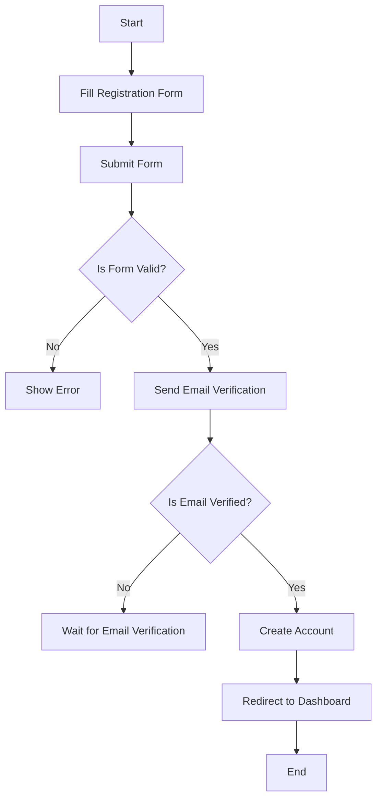
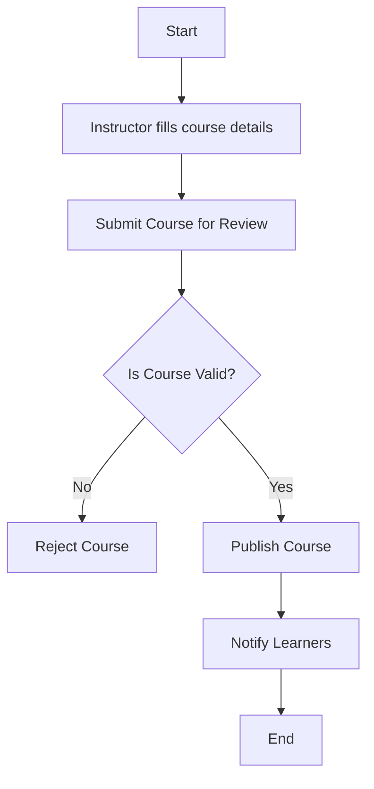
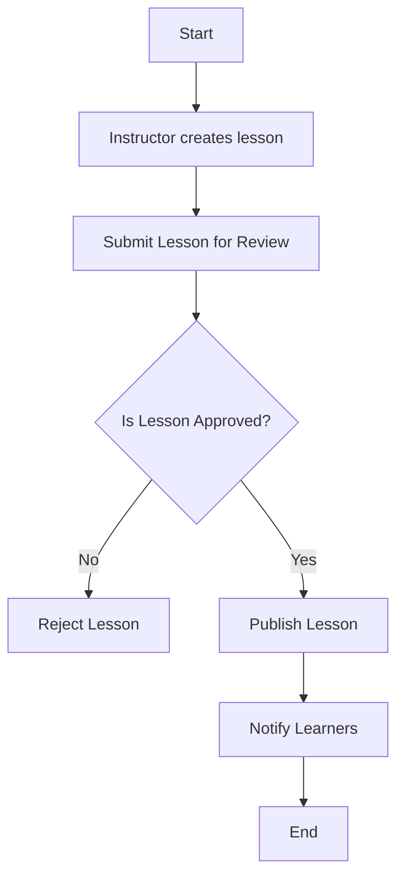
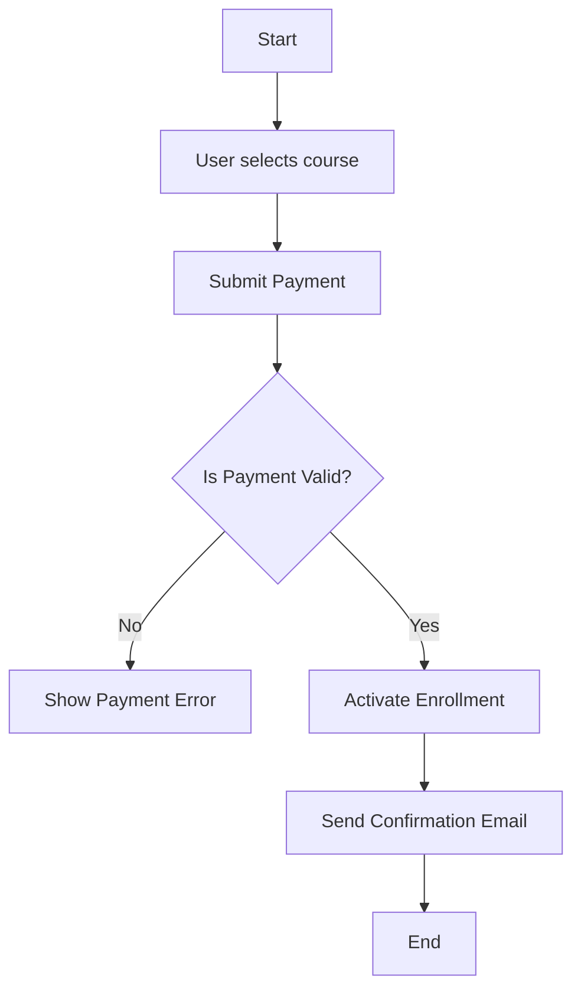
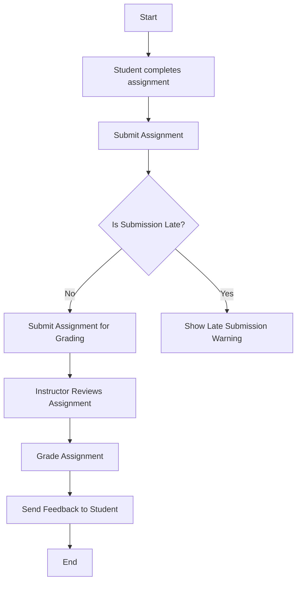
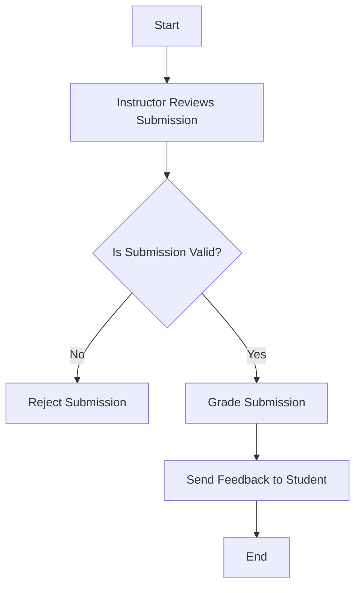
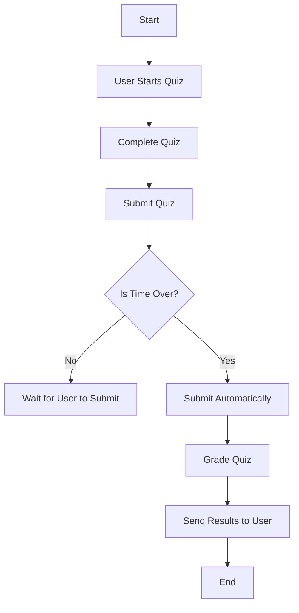
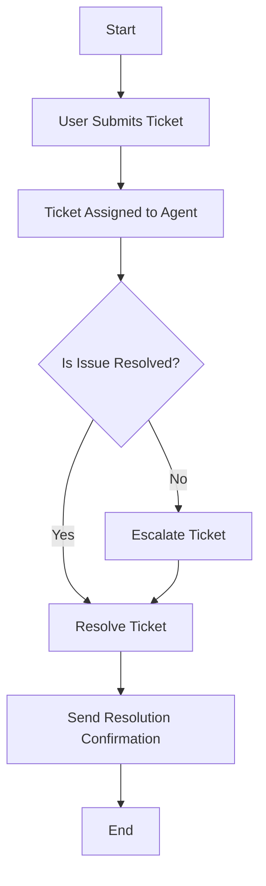

# 📝 Activity Workflow Diagrams – E-Learning Platform

This document contains UML activity diagrams and explanations for 8 complex workflows in the E-Learning Platform.

---

## 1. 🎓 User Registration Workflow

**Explanation:**

- **Start/End Nodes**: Start, End  
- **Actions**: Fill Registration Form, Submit Form, Show Error, Send Email Verification, Create Account, Redirect to Dashboard  
- **Decisions**: Valid form check, Email verified  
- **Swimlanes**: User, System  
- **Traceability**:  
  - FR-001: Account creation  
  - US-002: As a user, I want to register for an account  

---

## 2. 📘 Course Creation Workflow

**Explanation:**

- **Start/End Nodes**: Start, End  
- **Actions**: Fill course details, Submit for Review, Reject Course, Publish Course, Notify Learners  
- **Decisions**: Course validation  
- **Swimlanes**: Instructor, System  
- **Traceability**:  
  - FR-002: Course creation and management  
  - US-005: Publish a course for learners  

---

## 3. 📄 Lesson Creation Workflow

**Explanation:**

- **Start/End Nodes**: Start, End  
- **Actions**: Create lesson, Submit for Review, Reject Lesson, Publish Lesson, Notify Learners  
- **Decisions**: Lesson approval  
- **Swimlanes**: Instructor, System  
- **Traceability**:  
  - FR-003: Lesson creation  
  - US-007: Edit existing lessons  

---

## 4. 🧾 Enrollment Workflow

**Explanation:**

- **Start/End Nodes**: Start, End  
- **Actions**: Select course, Submit Payment, Show Payment Error, Activate Enrollment, Send Confirmation Email  
- **Decisions**: Payment validation  
- **Swimlanes**: User, System  
- **Traceability**:  
  - FR-004: Course enrollment  
  - US-006: Track learners' course status  

---

## 5. 📝 Assignment Submission Workflow

**Explanation:**

- **Start/End Nodes**: Start, End  
- **Actions**: Complete assignment, Submit Assignment, Show Late Submission Warning, Review, Grade Assignment, Send Feedback  
- **Decisions**: Submission timeliness  
- **Swimlanes**: Student, Instructor, System  
- **Traceability**:  
  - FR-005: Assignment submission  
  - US-008: Manage tasks for learners  

---

## 6. 📤 Submission Grading Workflow

**Explanation:**

- **Start/End Nodes**: Start, End  
- **Actions**: Review submission, Reject Submission, Grade Submission, Send Feedback  
- **Decisions**: Submission validity check  
- **Swimlanes**: Instructor, System  
- **Traceability**:  
  - FR-006: Grading process  
  - US-009: Submit/resubmit work online  

---

## 7. 🧪 Quiz Attempt Workflow

**Explanation:**

- **Start/End Nodes**: Start, End  
- **Actions**: Start quiz, Complete quiz, Submit quiz, Automatically submit, Grade quiz, Send results  
- **Decisions**: Time check  
- **Swimlanes**: User, System  
- **Traceability**:  
  - FR-007: Quiz grading  
  - US-011: Show quiz results  

---

## 8. 🛠️ Support Ticket Handling Workflow

**Explanation:**

- **Start/End Nodes**: Start, End  
- **Actions**: Submit ticket, Assign ticket to agent, Resolve ticket, Escalate ticket, Send confirmation  
- **Decisions**: Issue resolution check  
- **Swimlanes**: User, Agent, System  
- **Traceability**:  
  - FR-008: Ticket resolution  
  - US-012: Request support help  

---

## ✅ Summary

Each activity diagram:
- Aligns with at least one **functional requirement (Assignment 4)** and **user story (Assignment 6)**
- Uses **UML activity modeling** with decisions, parallel actions, and swimlanes
- Prepares the platform for **workflow automation, real-time tracking, and improved usability**

