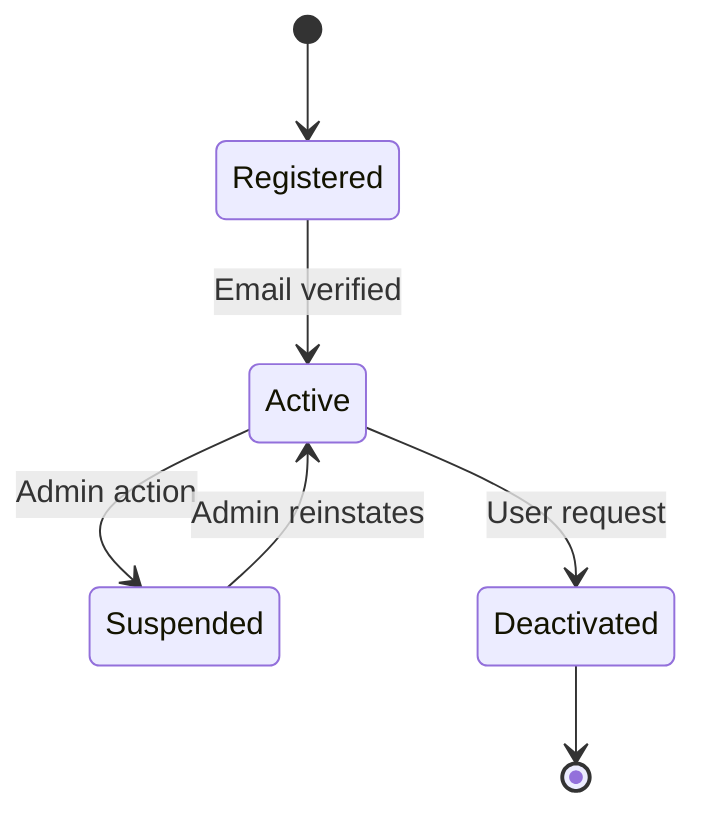
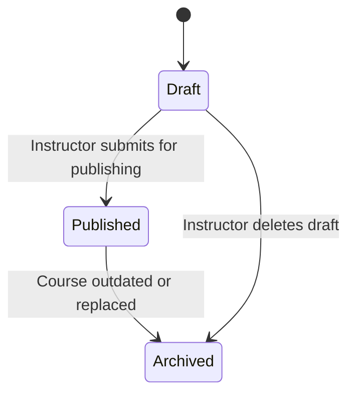
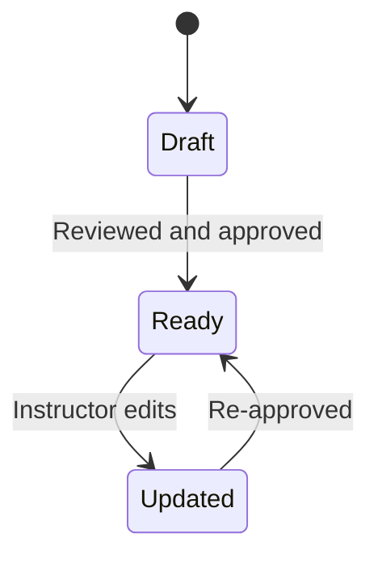
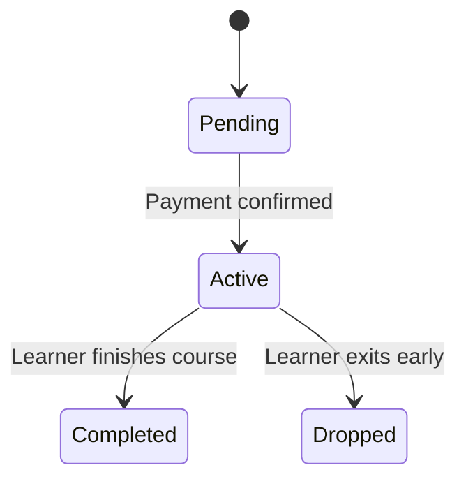
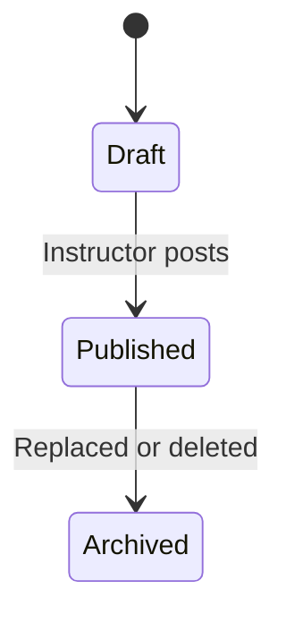
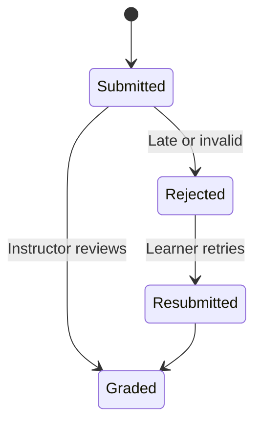
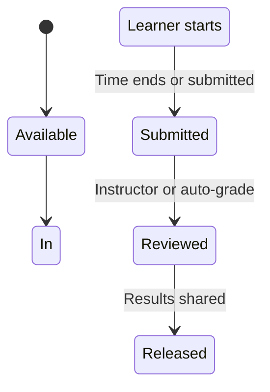
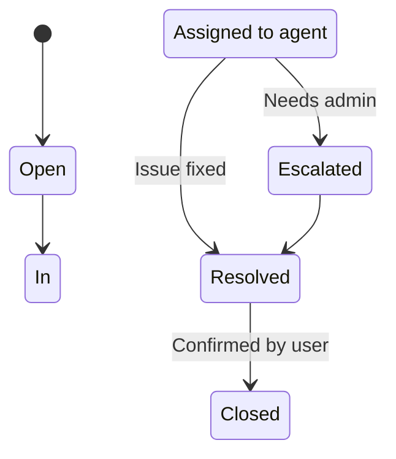

# 📦 Object State Diagrams – E-Learning Platform

This document contains UML state transition diagrams (in Mermaid) and explanations for 8 critical objects in the E-Learning Platform.

---

## 1. 🎓 User Account

**Explanation:**

- **States**: Registered, Active, Suspended, Deactivated  
- **Transitions**:  
  - Email verification activates account  
  - Admin may suspend for policy violation  
  - User can deactivate voluntarily  
- **Traceability**:  
  - FR-001: Account creation and management  
  - US-003: As a user, I want to deactivate my account  
- **Guard Conditions**: Can only suspend an active account

---

## 2. 📘 Course

**Explanation:**

- **States**: Draft, Published, Archived  
- **Transitions**:  
  - Courses move from Draft to Published upon review  
  - Older courses can be archived  
- **Traceability**:  
  - FR-002: Instructors can manage course content  
  - US-005: Publish a course for learners

---

## 3. 📄 Lesson

**Explanation:**

- **States**: Draft, Ready, Updated  
- **Transitions**:  
  - Lessons begin in Draft  
  - Once approved, they move to Ready  
  - Edits send them back to Updated, requiring reapproval  
- **Traceability**:  
  - FR-003: Lesson content lifecycle  
  - US-007: Edit existing lessons

---

## 4. 🧾 Enrollment

**Explanation:**

- **States**: Pending, Active, Completed, Dropped  
- **Transitions**:  
  - Pending → Active: On successful enrollment  
  - Active → Completed: Upon course completion  
  - Active → Dropped: Learner exits early  
- **Traceability**:  
  - FR-004: Course enrollment and progress  
  - US-006: Track learners' course status

---

## 5. 📝 Assignment

**Explanation:**

- **States**: Draft, Published, Archived  
- **Transitions**:  
  - Assignment is published once finalized  
  - Old ones can be archived for record-keeping  
- **Traceability**:  
  - FR-005: Assignment publishing  
  - US-008: Manage tasks for learners

---

## 6. 📤 Submission

**Explanation:**

- **States**: Submitted, Graded, Rejected, Resubmitted  
- **Transitions**:  
  - Can be rejected for plagiarism or lateness  
  - Students may be allowed to resubmit  
- **Traceability**:  
  - FR-006: Student submissions  
  - US-009: Submit/resubmit work online

---

## 7. 🧪 Quiz

**Explanation:**

- **States**: Available, In Progress, Submitted, Reviewed, Released  
- **Transitions**:  
  - Learners interact with quizzes through this flow  
  - Instructor or auto-grade system reviews and releases results  
- **Traceability**:  
  - FR-007: Online quizzes  
  - US-011: Show quiz results

---

## 8. 🛠️ Support Ticket

**Explanation:**

- **States**: Open, In Progress, Resolved, Escalated, Closed  
- **Transitions**:  
  - Admin escalation if agent can't solve  
  - Tickets are closed after confirmation  
- **Traceability**:  
  - FR-008: Help desk ticket system  
  - US-012: Request support help

---

## ✅ Summary

Each state diagram:
- Aligns with at least one **functional requirement (Assignment 4)** and **user story (Assignment 6)**
- Uses valid **UML state modeling** with transitions and guard logic
- Prepares the platform for **workflow automation and lifecycle tracking**

